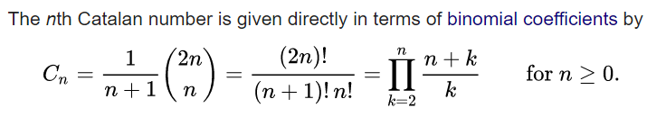
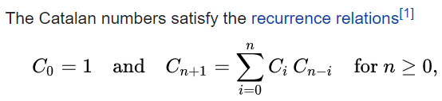
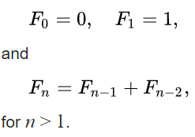

# Dijkstra

Assume `N` nodes, source node is indexed by `root`, using adjacency list

```
#include<climits> // INT_MAX
#include<vector>
#include<queue> // priority_queue
#include<<utility>> // pair
typedef pair<int, int> pii; // weight goes first 

vector<int> dist(N, INT_MAX);
dist[root] = 0;
priority_queue<pii, vector<pii>, greater<pii>> q;
q.push(make_pair(0, root));
while(!q.empty()){
  pii current = q.top();
  q.pop();
  for(pii neighbor : adj[current.second]){
    if(dist[neighbor.second] > dist[current.second] + neighbor.first){
      dist[neighbor.second] = dist[current.second] + neighbor.first;
      q.push(make_pair(dist[neighbor.second], neighbor.second));
    }
}
```

To track the actual shortest path, introduce an array `int Predecessor[N]`, 
update whenever `dist[neighbor.second]` changes, 
simply set to the new predecessor `current.second`. 

# Union Find

```
#include<map>
#include<<utility>> // pair

map<int, pair<int, int>> m; // map to parent & rank

void makeSet(int x, map<int, pair<int, int>>& m){
  m.insert(make_pair(x, make_pair(x, 0)));
}
    
int findSet(int x, map<int, pair<int, int>>& m){
  if(m[x].first == x) return x;
  else{
    m[x].first = findSet(m[x].first, m);
    return m[x].first; 
  }
}
    
void unionSet(int x, int y, map<int, pair<int, int>>& m){
  int parX = findSet(x, m);
  int parY = findSet(y, m);
  if(parX == parY) return;
  
  int rankX = m[parX].second; 
  int rankY = m[parY].second;
  if(rankX < rankY) m[parX].first = parY;
  else m[parY].first = parX;
  
  if(rankX == rankY) m[parX].second += 1; 
}
```


# Catalan number

The first Catalan numbers for n = 0, 1, 2, 3, ... are

1, 1, 2, 5, 14, 42, 132, 429, 1430, 4862, 16796, 58786, 208012, 742900, 2674440, 9694845, 35357670, 129644790, 477638700, 1767263190, 6564120420, 24466267020, 91482563640, 343059613650, 1289904147324, 4861946401452, ... 






# Fibonacci number 

The first Fibonacci numbers for n = 0, 1, 2, 3, ... are

0, 1, 1, 2, 3, 5, 8, 13, 21, 34, 55, 89, 144, 233, 377, 610, 987, 1597, 2584, 4181, 6765, 10946, 17711, 28657, 46368, 75025, 121393, 196418, 317811, ...




# KMP  


